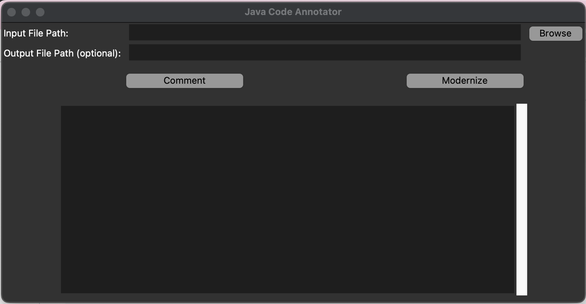

# Kitchensink modernizer: Java Code Annotation and Modernization Tool

This tool allows you to annotate and modernize legacy Java code using the Google Gemini API. It supports line-by-line inline comments for explanation, as well as full code modernization (e.g., suggesting migration to Spring Boot).

## 🚀 Features

- Supports Google Gemini GenAI API
- Works on individual files with `.java` extension (can be extended to other code types)
- Modes: `comment` (adds inline explanation) and `modernize` (suggests architectural updates)
- GUI with drag-and-drop support
- Command-line interface

---

## 🛠️ Setup Instructions

1. **Clone this repository**

```bash
git clone https://github.com/shijiahuang/kitchensink-modernizer.git
```

2. **Create and Activate a Conda Environment**

```bash
conda create -n kitchen_upgrade python=3.10
conda activate kitchen_upgrade
```

3. **Install Dependencies**

```bash
pip install -r requirements.txt
```

Or manually:
```bash
pip install python-dotenv google-generativeai tkinterdnd2
```

4. **Create a `.env` File**

```bash
cp .env.example .env
```

Edit `.env` and replace with your Google Gemini API key:
```
GOOGLE_API_KEY=your_google_api_key_here
```

---

## 💻 How to Use

### 1. Run the GUI App

```bash
python UI.py
```

- **Input File Path**: Use the file browser or drag a `.java` file here.
- **Output File Path** (optional): If left blank, a new file will be created with `_comment` or `_modernize` suffix.
- Click **Comment** to add inline documentation.
- Click **Modernize** to generate a refactored version using modern Java practices.

### 2. Use the CLI

```bash
python analyze_code.py path/to/InputFile.java --mode comment
```

- Modes:
  - `comment`: Adds inline explanation.
  - `modernize`: Suggests and outputs updated version.
- Optional:
  ```bash
  python analyze_code.py input.java -o output.java -m modernize
  ```

---

## 📂 Output

- A new file will be created (e.g., `InputFile_comment.java`)
- Contains the original code with AI-generated inline comments or a rewritten, modernized version.

---

## ✅ Tips

- Use small to medium sized files to stay within token limits.
- Modernization results are suggestions—manual review is recommended.

---

## 🔁 Example: Before and After Modernization

### Before:
```java
@ApplicationScoped
public class MemberRepository {
    @Inject
    private EntityManager em;

    public Member findById(Long id) {
        return em.find(Member.class, id);
    }

    public Member findByEmail(String email) {
        CriteriaBuilder cb = em.getCriteriaBuilder();
        CriteriaQuery<Member> criteria = cb.createQuery(Member.class);
        Root<Member> member = criteria.from(Member.class);
        criteria.select(member).where(cb.equal(member.get("email"), email));
        return em.createQuery(criteria).getSingleResult();
    }
}
```

### After:
```java
@Repository // Marks this class as a Spring Data Repository
@Transactional // Ensures methods are executed within a transaction
public class MemberRepository {

    @Autowired
    private EntityManager em;

    public Optional<Member> findById(Long id) {
        Member member = em.find(Member.class, id);
        return Optional.ofNullable(member); // Handle null safely
    }

    public Optional<Member> findByEmail(String email) {
        CriteriaBuilder cb = em.getCriteriaBuilder();
        CriteriaQuery<Member> criteria = cb.createQuery(Member.class);
        Root<Member> member = criteria.from(Member.class);
        criteria.select(member).where(cb.equal(member.get("email"), email));

        try {
            return Optional.of(em.createQuery(criteria).getSingleResult());
        } catch (NoResultException e) {
            return Optional.empty(); // Return empty Optional if no result
        }
    }
}
```

---

## 🖼️ GUI Preview

Here's a screenshot of the GUI application:


---

## 📧 Support

For bugs or feature requests, please contact [sjx2413@gmail.com] or open an issue.
